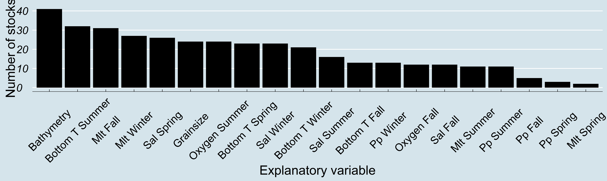
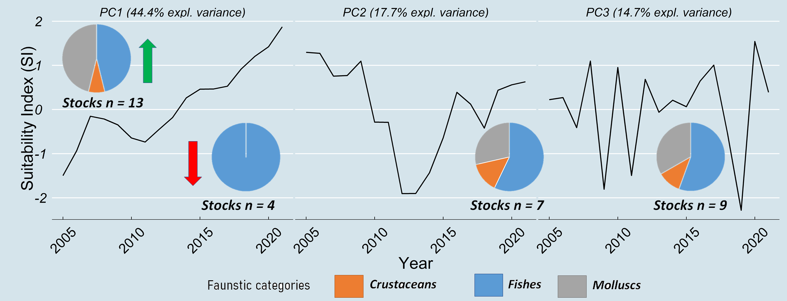

# Assessing Habitat Suitability alteration of species caught over the last 17 years from a trawl survey in the Adriatic sea (Mediterranean Sea)

This repo accompanies the poster _"Assessing Habitat Suitability alteration of species caught over the last 17 years from a trawl survey in the Adriatic sea (Mediterranean Sea)"_, presented at the [ECSA 59 conference](https://www.estuarinecoastalconference.com/) held in Kursaal, San Sebastian, Spain, on the 5-8 September 2022.

## Abstract
Habitat alteration, which threats marine biodiversity, is caused by the variation of environmental parameters and human activity. We applied a data-driven approach to model the habitat suitability (HS) of demersal species surveyed between 2005 and 2021 through a beam trawl survey conducted in late fall in the 0-100m depth waters of the Adriatic Sea (Mediterranean Sea). MaxEnt and Random forest models were applied to presence/absence data of the species falling in the 75 percentile of the occurrence frequency in survey hauls. Monthly values of environmental predictors were collected from the European Union's Earth observation programme and aggregated by season. Single species annual ensemble models were implemented to perform feature selection and predict habitat suitability over the surveyed area. The relation between the predictors and the species distributions were estimated by ranking the predictors based on their contribution to the models’ performance; time series of habitat suitability were obtained by counting the pixels where presence was predicted each year. Generalized Dynamic Principal Components model was applied to habitat suitability time series to identify common trends. This analysis highlighted that summer conditions had the strongest influence on the ecological niche, with summer bottom temperature ranked first among the environmental variables. The principal components of the estimated time series included monotonic increasing, dome-shaped, and random oscillation components (with 44.4%, 17.7% and 14.7% of variance explained respectively). The species loadings of the principal components suggested that habitat suitability increased over time for 13 species, decreased for 4 species, followed a dome-shaped trend for 7 species, and was randomly oscillating for 9 species. The majority of increasing species were invertebrates while all decreasing trends belonged to bony fishes. This study highlights the pivotal role of summer conditions on several commercial species' habitat, and provides insight into habitat alteration within an area subject to intense fishing activity.

## Data sources
 * Species presence/absence from [SoleMon survey](https://www.cnr.it/sites/default/files/public/media/navi/Dallaporta2018/SOLEMON.pdf) data
 * Environmental layers from [Copernicus](https://resources.marine.copernicus.eu/products) and [EMODnet](https://emodnet.ec.europa.eu/geonetwork/srv/eng/catalog.search#/search?resultType=details&sortBy=sortDate&from=1&to=20)
 
## Research questions
 * Which are the main drivers for habitat suitability modelling
 * Did habitat suitability change over time?
 * Can we group species based on habitat suitability trends?
 * Do habitat suitability alterations have spatial pattern?

## Methods
**Ecological niche modelling**: 
 
 * *Feature exploration*: on each year and for each species are independently applied exploratory runs based on MaxEnt and Random Forest models on the whole dataset (no train/test division), aimed to give a score = 1 to each variable retained (score for MaxEnt is defined as ME score; score for RF is defined as RF score). ME score was assigned to variables falling within the 95% cumulative distribution of the permutation importance statistic. In the case when only one variable is retained, it is used contribution importance statistic instead. In the case of RandomForest model, explanatory run was done by the mean of the Boruta function (Kursa and Rudnicki, 2010), with a number of run = 500. To each variable confirmed important to improve RandomForest model fit is assigned a RF score = 1. Scores by variable and model are summarized over the years and standardized over the number of years, then a common score is computed as Niche Importance Score (NIS) = (ME score + RF score) /2. 
 * *Feature selection*:	explanatory variables by species were sorted by NIS and it was calculated their cumulative importance (from 0 to 1). Feature selection for each species aims to identify the smaller set of variables giving the best predictive power. Candidate cut offs were 0.25, 0.33, 0.5, 0.66, 0.75, 0.9, 0.95. Each element of the tentative cut off vector was used to identify a pool of variables, by selecting those falling within the corresponding cumulative distribution. For each year, the following procedure was bootstrapped 60 times : a MaxEnt and a Random Forest model were fitted to presence/absence data using as explanatory variables the identified pool. The dataset was split in training (80%) and test (20%) to permit model prediction evaluation (set.seed equal to bootstrap run). Area under the curve (AUC) and kappa value were gathered for each model and year. AUC was considered 0 if below 0.5, kappa results were translated into categories. Predictive power associated to the cutoff value was calculated as 
 ```math
model score=  ((AUC_ME * Kappa_ME )+(AUC_RF * Kappa_RF))/2
```
  Model scores were averaged by cutoff value and species to identify the candidate cut off giving the best predictive power.
 
 * *Habitat suitability prediction*:variables by species  identified in the previous section were used to apply for each year 60 independent MaxEnt and RF models. The dataset was split in training (80%) and test (20%) to permit model prediction evaluation, setting the seed equal to the bootstrap run. Probability of presence by pixel on the whole solemon area grid was obtained from model predictions. Area under the curve (AUC) and kappa value were gathered for each model and year. AUC was considered 0 if below 0.5, kappa results were translated into categories. The suitable area for each species and years was calculated on the model prediction over the grid covering the solemon area. Results for Random Forest are presence/absence (binary) at each location; Max Ent predictions are a continuous variable (between 0 and 1), and are transformed to binary using the clog log threshold that include 10° percentile training presence. For each prediction and bootstrap run, grid values (binary) were weighted on the models’ predictive power:
 ```math
 grid cell score=  (grid value_ME* (AUC_ME * Kappa_ME )+ grid value_RF* (AUC_RF* Kappa_RF))/2
```
  To minimize the probability of false positives, for each species were excluded cells falling below the 15% cumulative distribution of the grid cell score. 

**Index clustering**: suitability index is calculated by counting the number of pixels where the species were predicted. Each index is a time series of species habitat suitability, spanning from 2005 to 2021 (ideally). Due to data constrains, in some years it was not possible to fit the machine learning models. Index with less than 15 data points were excluded and then the remaining data gaps were filled with linear interpolation. Time series were analysed with Generalized Dynamic Principal Component (Peña and Yohai, 2016), a dimension reduction technique that base on principal components technique aimed to identify a reduced number of common trends among a set of time series. Original time-series were assigned to the identified trends seeking for coorelation between the estimated principal components and the raw data.

**Index Spatial patterns**: suitability index timeseries by grid cell were modelled with Theil Shen robust regression where HS = α + β * Year + ε. Filled only cells where
year effect was significant (p value < 0.05)


## Results

**Research Question 1**: Which are the main drivers for habitat suitability modelling?


<!-- -->
*Figure 1: Number of times each explanatory variable was included into HS optimal model (on a total of 46 species modelled)*

**Research Question 2**: Did habitat suitability change over time?
<!-- -->
*Figure 2: aggregated HS time series with linear trend (red)*

**Research Question 3**: Can we group species based on habitat suitability trends?
<!-- -->
*Figure 3: aggregated HS time series clustering with GDPC model + associated number of species by faunistic category*

**Research Question 4**: Do habitat suitability alterations have spatial pattern?
<!-- -->
*Figure 4: Spatial distribution of significant HS trends*


## References


