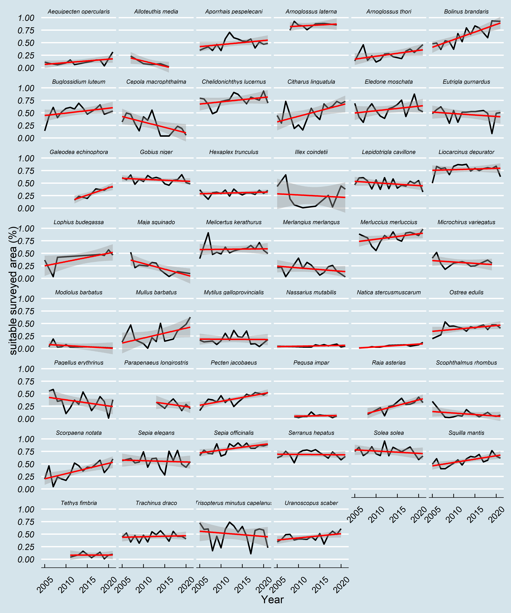

# Assessing Habitat Suitability alteration of species caught over the last 17 years from a trawl survey in the Adriatic sea (Mediterranean Sea)

This repo accompanies the poster _"Assessing Habitat Suitability alteration of species caught over the last 17 years from a trawl survey in the Adriatic sea (Mediterranean Sea)"_, presented at the [ECSA 59 conference](https://www.estuarinecoastalconference.com/) held in Kursaal, San Sebastian, Spain, on the 5-8 September 2022.

***Page Under Construction***
<!-- -->